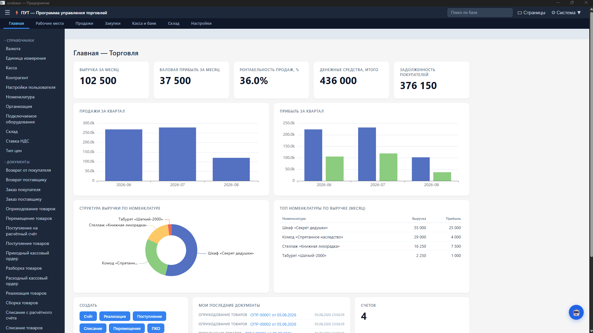
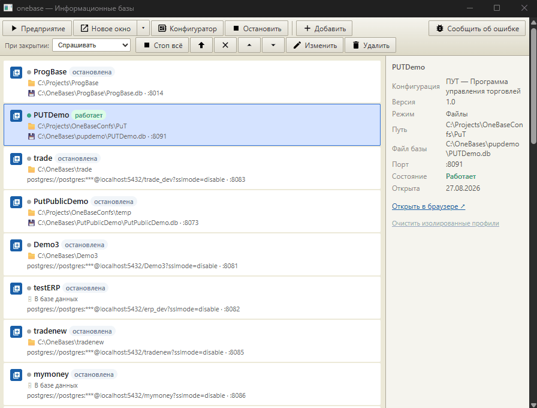
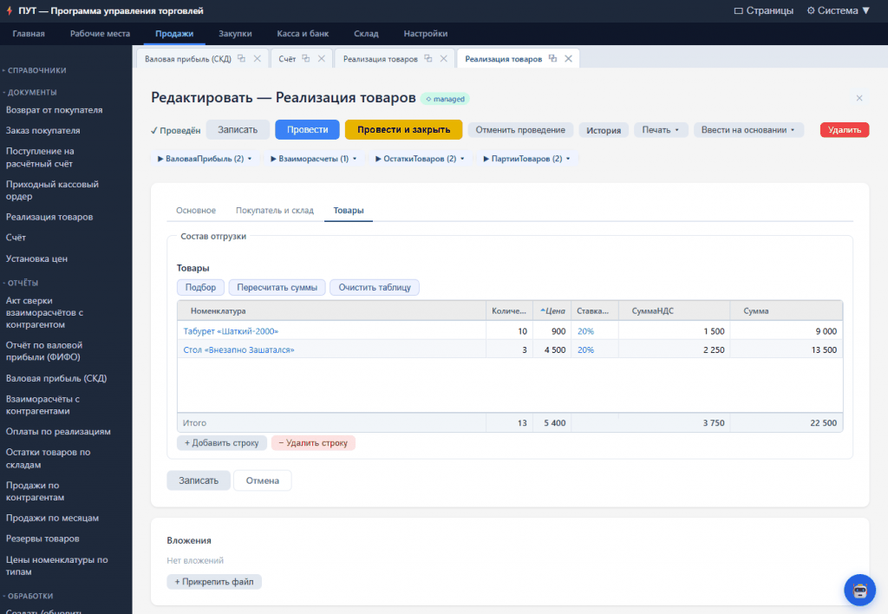
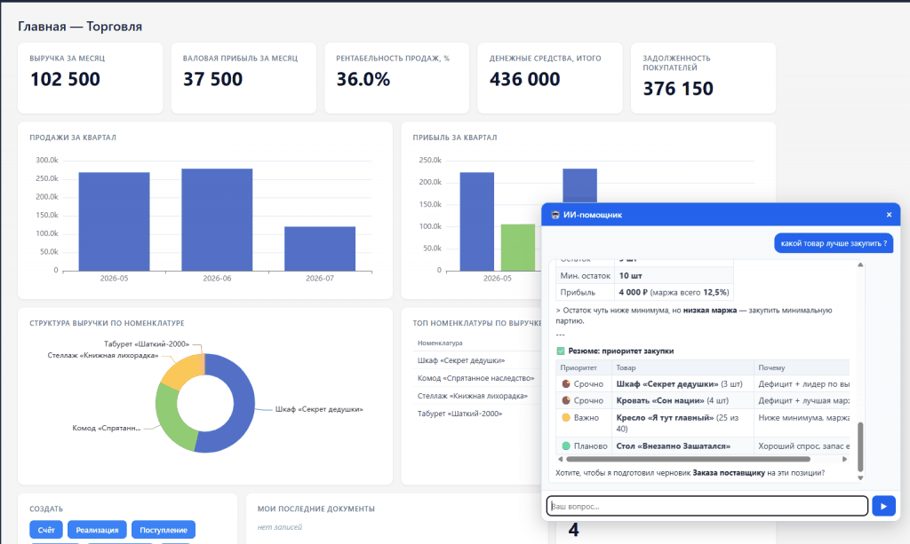
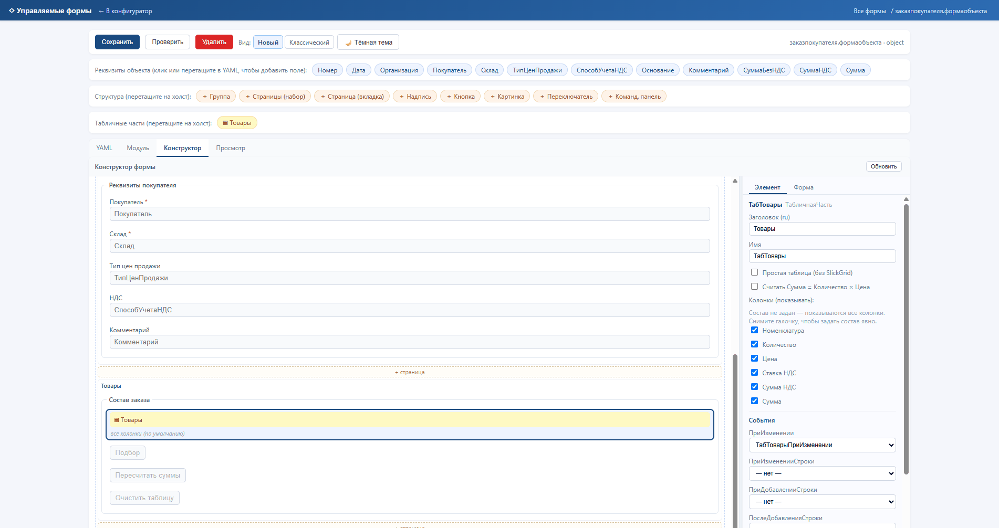
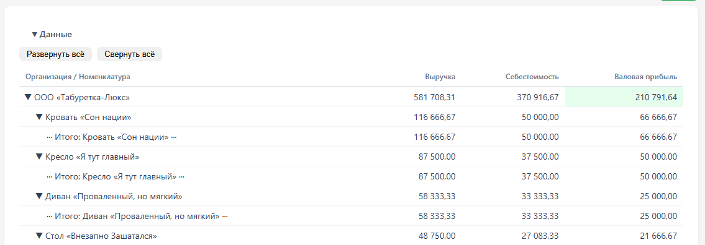
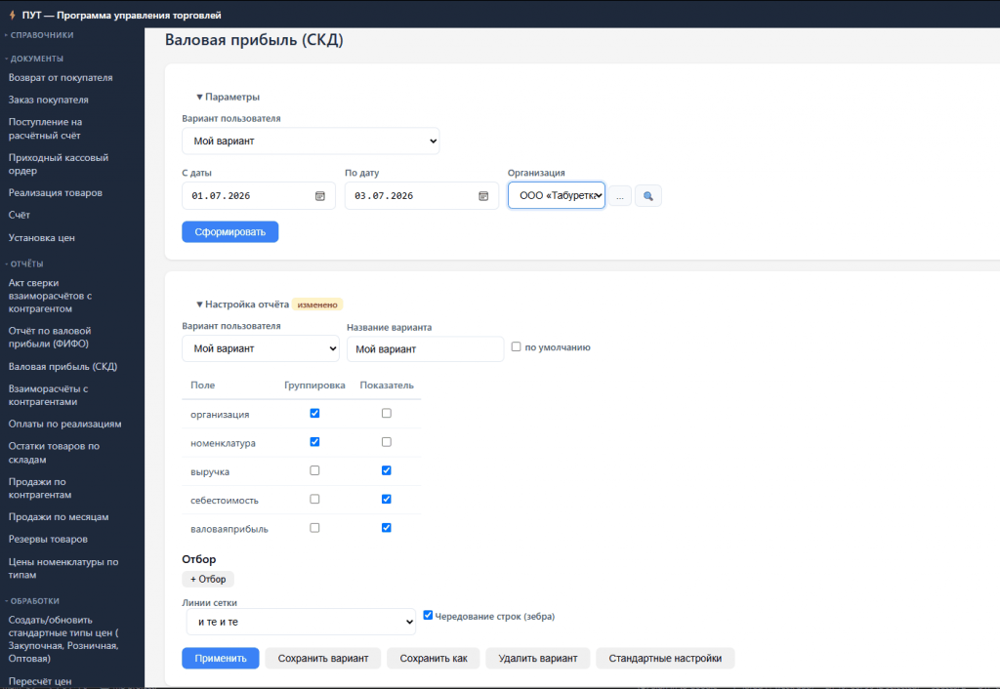

<div align="center">

# OneBase

**Открытая бизнес-платформа со знакомым учётным DSL, написанная на Go.**

Один бинарь исполняет прикладную конфигурацию поверх SQLite или PostgreSQL.

**Русский** · [English](README.en.md)

[Сайт проекта](https://onebase.ivantitov.tech) · [Живое демо](https://demo.ivantitov.tech) · [Telegram](https://t.me/IvanTitovTech) · [Документация](QUICKSTART.md)

<!-- Подписи бейджей закодированы в percent-encoding: shields.io отвечает 400 на
     кириллицу в URL как есть. %D1%80%D0%B5%D0%BB%D0%B8%D0%B7 = «релиз»,
     %D0%BB%D0%B8%D1%86%D0%B5%D0%BD%D0%B7%D0%B8%D1%8F = «лицензия». -->
[](https://github.com/ivanarama/onebase/releases/latest)
[](LICENSE)
[](https://go.dev/)



</div>

---

Одна «информационная база» = конфигурация (справочники, документы, регистры,
отчёты) + данные в SQLite или PostgreSQL + пользователи. Метаданные описываются
в YAML, бизнес-логика — на встроенном DSL. Управляется через лаунчер — окно
запуска информационных баз.

Модель знакома тем, кто работал с учётными платформами: документ **проводится**
и порождает движения регистров, регистры дают остатки и обороты, отчёты
обращаются к ним через виртуальные таблицы.

> 1С, 1С:Предприятие — товарные знаки ООО «1С». Проект OneBase разрабатывается
> независимо и не аффилирован с ООО «1С».

## Потрогать без установки

**[demo.ivantitov.tech](https://demo.ivantitov.tech)** — развёрнутая
конфигурация «Торговля» с демо-данными. На входе список пользователей —
Демонов, Складенец, Продажников, Снабженцев, Управленцев, Пользователь, — у
каждого своя роль и свой набор разделов; пароль у всех `12345`. База в
демо-режиме, данные сбрасываются каждую ночь в 02:00, так что ломать можно
смело.

## Как это выглядит

Выше — рабочий стол конфигурации «Торговля» в нативном окне: показатели за
месяц, диаграммы, последние документы.

**Лаунчер информационных баз** — точка входа: список баз, файловых и
PostgreSQL, запуск, конфигуратор, остановка:



**Форма документа** — вкладки, табличная часть на SlickGrid с подбором и
пересчётом, кнопки проведения, движения по регистрам прямо в шапке, вложения:



**ИИ-помощник** — отвечает по данным живой базы: разбирает остатки и маржу,
расставляет приоритеты закупки и предлагает подготовить черновик документа:



**Конструктор управляемых форм** — холст с живым предпросмотром, справа
свойства элемента и подписка на события (`ПриИзменении`, `ПриДобавленииСтроки`
и прочие), рядом вкладки с YAML и модулем формы:



**Отчёт с группировками и итогами** — иерархия «Организация → Номенклатура»
разворачивается, итоги считаются по каждому уровню:



**Компоновка, а не жёсткий макет** — структуру отчёта меняет сам пользователь:
галочками включает группировки и показатели, добавляет отборы, настраивает
оформление и сохраняет это как свой вариант. Конфигурация при этом не
трогается — настройки лежат в базе персонально у каждого:



## Что умеет

- **Учёт** — регистры накопления с остатками и оборотами, регистры сведений со
  срезами, план счетов и регистр бухгалтерии с двойной записью и субконто,
  FIFO-списание партий
- **Интерфейс** — управляемые формы с визуальным конструктором, конструктор
  запросов, отчёты с вариантами компоновки, группировками, отборами и условным
  оформлением, диаграммы, дашборды и виджеты, печатные формы с макетами и PDF
- **Доступ** — роли, ограничение доступа на уровне записей, маскирование
  персональных данных, двухфакторная аутентификация и SSO
- **Интеграции** — REST API с английскими именами полей, MCP-сервер,
  ИИ-ассистент внутри интерфейса, обмен данными между базами, импорт
  XML-выгрузки конфигурации 1С и двусторонний обмен управляемыми формами
- **Эксплуатация** — полнотекстовый поиск, регламентные задания, бэкап и
  восстановление, самообновление из релизов GitHub, интерфейс на 16 языках

Полный каталог возможностей с поиском и фильтром «что сейчас в тестировании» —
на сайте: **[onebase.ivantitov.tech/docs.html](https://onebase.ivantitov.tech/docs.html)**.
Он собирается из [`docs/features.md`](docs/features.md) этого репозитория, так
что исходник всегда рядом с кодом, а читать удобнее там.

## Установка

**Windows** — скачайте `onebase-windows-amd64.zip` со страницы
[Releases](https://github.com/ivanarama/onebase/releases/latest), распакуйте и
запустите **`onebase-gui.exe`** двойным кликом. Или через PowerShell:

```powershell
irm https://raw.githubusercontent.com/ivanarama/onebase/main/install.ps1 | iex
```

**Linux / macOS:**

```bash
tar xzf onebase-linux-amd64.tar.gz          # macOS: onebase-darwin-arm64.tar.gz
sudo mv onebase-linux-amd64/onebase /usr/local/bin/
onebase start
```

Какой архив брать под вашу платформу, что лежит внутри и как обновить уже
установленную копию — [QUICKSTART.md → Установка](QUICKSTART.md#установка).

## Быстрый старт

```bash
onebase init --template warehouse ./склад    # проект из шаблона
onebase dev --project ./склад --sqlite ./склад.db --open
# → браузер откроется сам на http://localhost:8080/ui, когда сервер будет готов
```

Правьте YAML и `.os` — открытая страница перечитает себя без F5. Путь без
командной строки, через лаунчер, и всё остальное —
[QUICKSTART.md](QUICKSTART.md).

Частые команды:

| Команда | Описание |
|---|---|
| `onebase start` | Открыть лаунчер информационных баз |
| `onebase dev --project ./my-app --sqlite ./my-app.db --open` | Dev-сервер с hot reload |
| `onebase run --project ./my-app --sqlite ./my-app.db` | Production-сервер |
| `onebase check --project ./my-app` | Проверить конфигурацию: парсинг, компиляция и прогон запросов |
| `onebase langref` | Справочник встроенного языка |

Полный список — [QUICKSTART.md → Команды CLI](QUICKSTART.md#команды-cli).

## Два способа разрабатывать

**Файлами под git.** Конфигурация — папка с YAML и `.os` на диске
(`config_source: file`). Обычный репозиторий: ветки, дифф, ревью, история,
откат. `onebase dev` держит сервер с hot reload — сохранил файл, открытая
страница перечитала себя без F5. Правится чем угодно, от VS Code до `sed`.

**Конфигуратором в базе.** Конфигурация лежит в таблице `_onebase_config` самой
базы (`config_source: database`), редактируется деревом метаданных и
редакторами прямо в лаунчере. Путь к папке пользователю знать не нужно — база
самодостаточна, её можно отдать как один файл SQLite.

Между режимами можно ходить: в конфигураторе «Выгрузить» кладёт конфигурацию в
рабочий каталог, «Загрузить» возвращает правки обратно в базу. То есть код
можно завести в git даже у той базы, которая живёт у пользователя.

Визуальные редакторы — конструктор форм, компоновка отчётов, дерево
метаданных — работают в обоих режимах: в файловом они пишут те же YAML-файлы,
которые лежат в репозитории.

## Разработка с ИИ

Платформа умышленно устроена так, чтобы её конфигурацию мог писать агент, а не
только человек.

- **`onebase init` кладёт в проект `AGENTS.md`** — 1004 строки, сгенерированные
  из самой платформы: структура конфигурации, рабочий цикл, все встроенные
  функции DSL, схема метаданных, модель безопасности. Агенту не надо угадывать
  синтаксис по примерам, он его читает. Обновить в существующем проекте —
  `onebase ai-guide --output AGENTS.md`.
- **`onebase check` — настоящая обратная связь.** Он не просто парсит, а
  компилирует и **исполняет** запросы модулей, поэтому ловит `no such column`
  до запуска базы. Агент получает конкретную ошибку с местом, а не «выглядит
  правдоподобно».
- **`onebase mcp` — MCP-сервер поверх тех же команд:** `check`, `query`,
  `describe`, `config_diff`, `config_versions`, `fmt_check`, `procrun`. По
  умолчанию только чтение; изменяющие инструменты включаются точечными флагами
  (`--allow-fmt-write`, `--allow-refactor-write`, `--allow-config-rollback`,
  `--allow-procrun`) или общим `--allow-write`.
- **ИИ-помощник внутри базы** отвечает по живым данным с учётом прав
  пользователя — см. кадр выше.
- **Конвейер сопровождения Claude/Codex** использует общий детерминированный
  `pipelinectl` для обычных REVIEW/MERGE и сохраняет полный skill-fallback для
  base-sync и recovery. Настройка и диагностика описаны в
  [docs/maintenance-pipeline.md](docs/maintenance-pipeline.md#экономичный-путь-pipelinectl).

Как это выглядит на практике — статья [«От ТЗ до работающей базы за 37 минут:
ИИ-агент сам пишет, проверяет и чинит
конфигурацию»](https://infostart.ru/1c/articles/2756473/).

## Архитектура: платформа / конфигурация / база

| Уровень | OneBase | Физически |
|---|---|---|
| Платформа | `onebase.exe` | Go-бинарник: рантайм, DSL, REST API, лаунчер |
| Конфигурация | Папка (`catalogs/`, `documents/`, …) или строки в БД | YAML + `.os` скрипты |
| Информационная база | SQLite-файл или PostgreSQL | Прикладные и служебные таблицы; при `config_source: database` — также `_onebase_config` |

Уровни независимы: один и тот же бинарь исполняет любую конфигурацию, а одна и
та же конфигурация работает и на SQLite, и на PostgreSQL. Где физически лежит
конфигурация — в папке под git или в самой базе — выбирается флагом
`config_source`, см. [Два способа разрабатывать](#два-способа-разрабатывать).

## Примеры конфигураций

В папке [`examples/`](examples/) — девять готовых конфигураций:

| Папка | Назначение | Объекты |
|---|---|---|
| [`minimal/`](examples/minimal) | Учебный шаблон — минимальный набор для понимания структуры | 1 справочник, 3 документа, 1 регистр, 2 отчёта, 3 обработки, роль |
| [`trade/`](examples/trade) | Флагманский пример — торговля и склад с FIFO | 8 справочников, 9 документов, 6 регистров накопления, 1 сведений, 11 отчётов, 16 обработок, 13 перечислений, 4 роли |
| [`accounting/`](examples/accounting) | Бухгалтерский учёт — двойная запись, план счетов, субконто | 4 справочника, 8 документов, план счетов, регистр бухгалтерии, 6 отчётов, 6 перечислений, 2 роли |
| [`tasks/`](examples/tasks) | Управление задачами — Agile-спринты, тайм-трекинг | 4 справочника, 4 документа, 2 регистра, 6 отчётов, 5 обработок, 3 роли |
| [`crm/`](examples/crm) | CRM — воронка продаж, сделки, контакты | 7 справочников, 6 документов, 4 регистра, 10 отчётов, 6 обработок, 3 роли |
| [`finance/`](examples/finance) | Домашние финансы — доходы, расходы, цели | 6 справочников, 5 документов, 3 регистра, 10 отчётов, 4 обработки, 2 роли |
| [`cms/`](examples/cms) | Сайт и заказы — контент, каталог, приём заказов | 15 справочников, 1 документ, 7 обработок, 5 перечислений, 2 роли |
| [`callcenter/`](examples/callcenter) | Колл-центр (CTI) — приём звонков, скрин-поп, click-to-call | 5 справочников, 5 документов, 2 регистра сведений, 7 обработок, 10 перечислений, 2 роли |
| [`archive/`](examples/archive) | Делопроизводство — регистрация документов | 1 документ, 1 обработка |

```bash
onebase dev --project ./examples/trade --sqlite trade_dev.db --open
```

## DSL (язык модулей)

Бизнес-логика — файлы `.os` в папке `src/`. Синтаксис знаком разработчикам
учётных систем:

```bsl
// Проведение документа — FIFO списание партий
Процедура ОбработкаПроведения()
  Движения.ПартииТоваров.Очистить();

  Запрос = Новый Запрос;
  Запрос.Текст = "ВЫБРАТЬ ДатаПоставки, КоличествоОстаток, СуммаОстаток
                  ИЗ РегистрНакопления.ПартииТоваров.Остатки()
                  ГДЕ Номенклатура = &Ном И КоличествоОстаток > 0
                  УПОРЯДОЧИТЬ ПО ДатаПоставки";
  Запрос.УстановитьПараметр("Ном", Строка.Номенклатура);

  Партии = Запрос.Выполнить();
  Для Каждого Партия Из Партии Цикл
    Если Остаток <= 0 Тогда
      Прервать;
    КонецЕсли;
    Дв = Движения.ПартииТоваров.Добавить();
    Дв.ВидДвижения = "Расход";
    Дв.Количество = КолВоИзПартии;
  КонецЦикла;
КонецПроцедуры
```

| Конструкция | Пример |
|---|---|
| Переменные | `Сумма = 0;` |
| Условия | `Если Сумма > 0 Тогда ... КонецЕсли;` |
| Циклы | `Для Каждого Э Из Массив Цикл ... КонецЦикла;` |
| Прерывание цикла / пропуск итерации | `Прервать;` / `Продолжить;` |
| Попытка/Исключение | `Попытка ... Исключение ... КонецПопытки;` |
| Запросы | `Запрос = Новый Запрос; Запрос.Выполнить();` |
| Транзакции | `НачатьТранзакцию(); ЗафиксироватьТранзакцию();` |
| Коллекции | `Новый Массив`, `Новый Структура`, `Новый Соответствие` |
| Печатные формы | `Новый ТабличныйДокумент` |
| HTTP-запросы | `HTTPЗапрос("GET", "https://...")` |

### Язык двуязычный

У каждого ключевого слова есть английский синоним, и модуль можно написать
целиком по-английски:

```bsl
Var total; total = 0;
For each row in rows Do
    If row.Qty > 0 And Not row.Cancelled Then
        total = total + row.Qty;
    EndIf;
EndDo;
Return total;
```

То же касается объектов доступа (`Documents`, `Catalogs`, `Query`) и встроенных
функций (`Message`/`Сообщить`, `Str`/`Строка`, `StrReplace`/`СтрЗаменить`):
английский синоним есть у 370 названий языка. Смешивать языки в одном файле
можно, регистр не важен.

Русским остаётся окружение: тексты ошибок, имена типов в выводе, документация и
все примеры конфигураций. Английские имена — не отдельный «режим», а синонимы в
таблице лексера, поэтому конфигурацию на английском поймёт и русскоязычный
разработчик.

**Полный справочник языка — [`docs/dsl-reference.md`](docs/dsl-reference.md):**
169 функций, 159 методов объектов, 18 конструкций и 37 элементов языка запросов,
с сигнатурами, параметрами и примерами. Открывается прямо здесь, на GitHub —
качать платформу, чтобы посмотреть язык, не нужно. Справочник генерируется из
самой платформы (`onebase langref`), поэтому не может разойтись с ней: сверка
живёт в тестах.

## Документация

| Документ | О чём |
|---|---|
| [onebase.ivantitov.tech](https://onebase.ivantitov.tech) | Сайт проекта: каталог возможностей с поиском, галерея, релизы, публикации |
| [QUICKSTART.md](QUICKSTART.md) | Установка, первый проект, структура конфигурации, деплой на сервер, команды CLI |
| [`docs/dsl-reference.md`](docs/dsl-reference.md) | Справочник встроенного языка и языка запросов |
| [DEVELOPER.md](DEVELOPER.md) | Форматы объектов конфигурации: план счетов, регистр бухгалтерии, субконто и прочее |
| [`docs/features.md`](docs/features.md) | Что появилось в свежих сборках и как это попробовать |
| [`docs/forms.md`](docs/forms.md) | Управляемые формы |
| [`docs/rest-api-v2.md`](docs/rest-api-v2.md) | REST API |
| [`docs/ai-assistant.md`](docs/ai-assistant.md) · [`docs/mcp.md`](docs/mcp.md) | ИИ-ассистент и MCP-сервер |
| [`docs/DEPLOYMENT.md`](docs/DEPLOYMENT.md) · [`docs/reverse-proxy.md`](docs/reverse-proxy.md) | Развёртывание и обратный прокси |

## Что менялось между версиями

[`CHANGELOG.md`](CHANGELOG.md) — сводка по версиям со ссылками на полные заметки
в [`docs/releases/`](docs/releases/). Смотрите туда перед обновлением движка на
рабочей базе.

Между версиями каждый коммит в `main` выходит автосборкой `build-NNN`; что в них
появилось — в [`docs/features.md`](docs/features.md), с инструкциями «как
попробовать».

## Поддержать проект

Проект развивается в свободное время. Если OneBase оказался полезным — буду рад
поддержке:

| Способ | Реквизиты |
|---|---|
| TON / USDT | `UQDmhcdNyqut5nE8K7yJCvXwNST2qMIBk5gRgFInpO7eBO-x` |
| ЮMoney (карта РФ) | [yoomoney.ru/to/41001428157040](https://yoomoney.ru/to/41001428157040) |

## Публикации

Свежее:

- [От ТЗ до работающей базы за 37 минут: ИИ-агент сам пишет, проверяет и чинит конфигурацию](https://infostart.ru/1c/articles/2756473/) — статья, Инфостарт
- [Один промпт — готовая конфигурация](https://youtu.be/JxQTz-dYoJI) — видео, YouTube

Полный список статей и видео — [docs/publications.md](docs/publications.md).

[](https://infostart.ru/)

## Авторы

Платформа OneBase — © 2026 Иван Титов. Код написан Иваном Титовым, в том числе
с использованием инструментов разработки на базе ИИ (Claude Code). Согласно
позиции разработчиков таких инструментов и применимому законодательству
(в РФ — ст. 1257 ГК РФ), ИИ-ассистент является инструментом, а права на
созданный по заданиям человека код принадлежат автору задания. Пометки вида
`Generated-with` в истории git — указание на использованный инструмент, а не
передача авторских прав.

Авторство и лицензия конкретной конфигурации задаются в её свойствах
(`config/app.yaml`: `author` / `copyright` / `license`) и видны в
пользовательском режиме на экране «О программе».

## Лицензия

[MIT](LICENSE) © 2026 Иван Титов

1С, 1С:Предприятие — товарные знаки ООО «1С». OneBase разрабатывается
независимо, не аффилирован с ООО «1С» и не является его продуктом.

Конвертеры `onebase convert` (импорт XML-выгрузки конфигурации) и
`onebase forms convert-from-1c` / `convert-to-1c` (двусторонний обмен
управляемыми формами) работают только с публичными текстовыми форматами
выгрузки конфигурации (XML и BSL), которые открыты по спецификации EDT
и используются сторонними инструментами (OScript, EDT-плагины).
Все маппинги типов реквизитов, событий и элементов форм реализованы как
собственные таблицы соответствий по общедоступной документации.
Лексер Module.bsl — минимальный токенизатор без построения синтаксического
дерева; тела процедур копируются как цитаты для интероперабельности,
без реверс-инжиниринга исполнения.

Имена ссылочных типов (`CatalogRef.X`, `DocumentRef.X`) — общеупотребительные
термины русскоязычного бизнес-софта, не охраняемые товарные знаки.
Упоминания 1С:Предприятие в репозитории — исключительно для описания
совместимости при импорте/экспорте данных.
